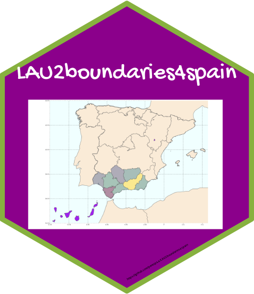
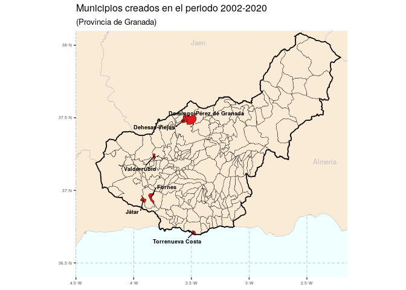
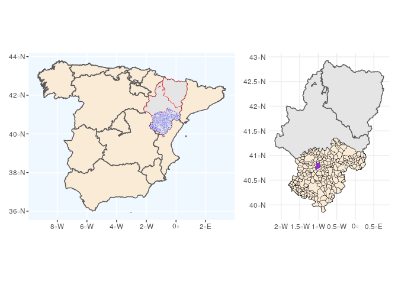
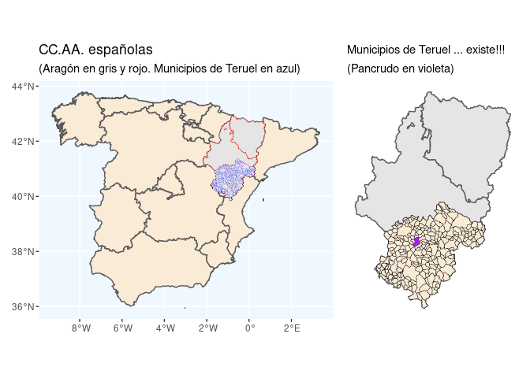
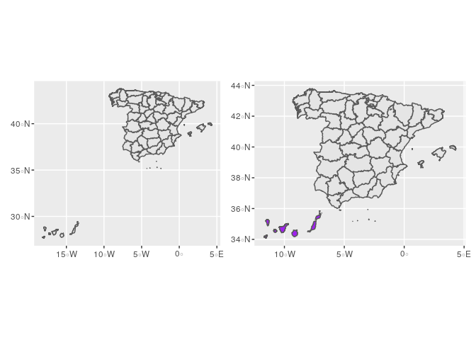

<!-- README.md is generated from README.Rmd. Please edit that file -->

# LAU2boundaries4spain 

**LAU2boundaries4spain** es un paquete de R cuyo objetivo es facilitar
la realización de mapas a nivel municipal para España. Para ello se
ofrecen las geometrías o contornos municipales españoles para los años
2002 a 2021.

¿Es necesaria esta información? Evidentemente pensamos que sí. En España
el organismo encargado de ofrecer está información es el [Instituto
Geográfico Nacional](http://www.ign.es/web/ign/portal) (IGN), pero el
IGN no ofrece un registro histórico de las lineas límite municipales;
solo ofrece la información más actual. Por lo tanto, si se quisiera
representar gráficamente, por ejemplo, la población o la renta per
cápita por municipios en el año 2010, ocurriría que los contornos
ofrecidos por el IGN no cuadrarían con la información estadística del
INE referida a 2010. La razón es que la relación de municipios puede
cambiar con el tiempo; por ejemplo, [en el año 2018 se crearon en España
7 nuevos
municipios](https://www.ine.es/daco/daco42/codmun/codmun19/19codmunmod.htm),
entre ellos El Palmar de Troya, que surge como una segregación de
Utrera.

Para obtener información detallada de los datos ofrecidos y de su
proceso de creación puede visitarse la **página web del proyecto**
[aquí](https://ropenspain.github.io/LAU2boundaries4spain/) o en las
viñetas del paquete
[aquí](https://ropenspain.github.io/LAU2boundaries4spain/articles/intro-to-lau2boundaries4spain.html)
y
[aquí](https://ropenspain.github.io/LAU2boundaries4spain/articles/detailed-info-lau2boundaries4spain.html).

Durante el periodo 2002-2021 desaparecieron en España 4 municipios [1] y
se crearon 25 municipios nuevos. El listado completo de alteraciones
municipales puede consultarse en el INE. Como ejemplo, el siguiente
gráfico muestra los 6 municipios nuevos creados en la provincia de
Granada durante el periodo 2002-2020.



Como curiosidad, en 2021 hay en España 8.131 municipios, pero el fichero
`municipios_2021` tiene 8212 registros. ¿Cuál es la razón de esta
discrepancia entre el número oficial de municipios y los datos del IGN?
¿Se inventa el IGN municipios? Evidentemente no. La razón es que en
España existen territorios que no pertenecen a un único municipio, son
los llamados **condominios**. Actualmente en los ficheros del IGN
existen 81 condominios, la mayoría de estos territorios están en las
provincias Burgos y Navarra, siendo el mayor de ellos las Bardenas
Reales. [Aquí](https://es.wikipedia.org/wiki/Facer%C3%ADa) puedes ver
los territorios comunales, generalmente llamados *Facerías*, en la
provincia de Navarra.

Como el objetivo último de este repositorio es facilitar la
representación gráfica de información estadística a nivel municipal, se
facilitan los contornos de los términos municipales españoles ajustados
a los municipios existentes a 1 de enero de cada año desde 2002, de
forma que cuadren exactamente con el Padrón de dicho año. Los contornos
a fecha de 1 de enero de 2002 son consistentes con los existentes en el
censo de 2001, con fecha de referencia 1 de noviembre de dicho año.

Creemos que dicha base de datos es útil por varias razones. El
[Instituto Geográfico Nacional](http://www.ign.es/web/ign/portal) (IGN)
ofrece, a través del [Centro de
Descargas](http://centrodedescargas.cnig.es/CentroDescargas/index.jsp)
del Centro Nacional de Información Geográfica, los recintos municipales
–también los provinciales y autonómicos– dentro de la Base de Datos de
Líneas de Límite Municipal en la **Información Geográfica de
Referencia**, sin embargo estas bases de datos son de actualización
continua, de forma que lo que se dispone son los municipios “en el
momento actual”, y no existe un histórico que puede ser de utilidad por
muchas razones. Así pues, hasta donde nosotros conocemos, no se dispone,
por ejemplo, de una capa vectorial de los polígonos municipales del año
2006, o de la de los municipios correspondientes al censo de 2001. Esta
información es necesaria si queremos combinar la información geográfica
con la información estadística municipal histórica procedente, por
ejemplo, del [Instituto Nacional de Estadística](http://www.ine.es/)
(INE).

Este repositorio pretende cubrir esa laguna que, de momento, no ha sido
satisfecha por las instituciones oficiales. El repositorio está
disponible como un *package* de *R* alojado en *Github*:
<https://github.com/rOpenSpain/LAU2boundaries4spain>. La información
ofrecida ha ido elaborándose durante bastante tiempo a partir de
diversos trabajos (Goerlich, Mas, Azagra y Chorén 2006, 2007; Goerlich,
Ruiz, Chorén y Albert 2015; Reig, Goerlich y Cantarino 2016).

Información más detallada del proceso seguido para la construcción de
los diferentes ficheros de lindes puede encontrase en las dos
*vignettes* del *package*, concretamente
[aquí](https://ropenspain.github.io/LAU2boundaries4spain/articles/intro-to-lau2boundaries4spain.html)
y
[aquí](https://ropenspain.github.io/LAU2boundaries4spain/articles/detailed-info-lau2boundaries4spain.html)

## Datos

El paquete proporciona:

-   un fichero con los lindes de las CC.AA (`CCAA`)
-   un fichero con los lindes provinciales (`Provincias`)
-   un fichero con los lindes municipales para cada año del periodo
    2002-2021 (por ejemplo `municipios_2021`)

Los ficheros se ofrecen en formato `spatial-df` del paquete
[`sf`](https://CRAN.R-project.org/package=sf)

## Instalación

Para instalar el paquete:

``` r
remotes::install_github("rOpenSpain/LAU2boundaries4spain")
```

## Uso

Para cargar los datos en R:

``` r
library(LAU2boundaries4spain)
CCAA <- CCAA                         #- geometrías de CC.AA
Provincias <- Provincias             #- geometrías provinciales
municipios_2017 <- municipios_2017   #- geometrías municipales año 2017 (años posibles: 2002 - 2021)
```

## Algunos ejemplos de uso

-   Un gráfico simple con el método por defecto del paquete `sf`:

``` r
library(sf)
Provincias <- Provincias
plot(Provincias, max.plot = 1)
```



-   Municipios de Teruel en 2017

``` r
library(LAU2boundaries4spain)
library(tidyverse)
library(sf)
library(patchwork)
#> Warning: package 'patchwork' was built under R version 4.0.5
  
CCAA_peninsular <- CCAA %>% filter(!NombreCCAA %in% c("Canarias", "Illes Balears", "Ciudades Autónomas de Ceuta y Melilla"))
Prov_aragon <- Provincias %>% filter(NombreCCAA == "Aragón")
muni_teruel_2017 <- municipios_2017 %>% filter(NombreProv == "Teruel")
Pancrudo <- muni_teruel_2017 %>% filter(NombreMuni == "Pancrudo")

p1 <- ggplot(data = CCAA_peninsular) + geom_sf(fill = "antiquewhite") + 
            geom_sf(data = Prov_aragon, color = "red", size = 0.15) +
            geom_sf(data = muni_teruel_2017, color = "blue", size = 0.05) + theme(panel.background = element_rect(fill = "aliceblue")) +
            labs(title = "CC.AA. españolas", subtitle = "(Aragón en gris y rojo. Municipios de Teruel en azul)") 

p2 <- ggplot(data = Prov_aragon) + geom_sf() + 
      geom_sf(data = muni_teruel_2017, color = "black", size = 0.15, fill = "antiquewhite") + 
      geom_sf(data = Pancrudo, fill = "purple", size = 0.1) + theme_minimal() +
      labs(title = "Municipios de Teruel ... existe!!!", subtitle = "(Pancrudo en violeta)") +
      theme(axis.text = element_blank()) +
      theme(panel.grid.major = element_blank()) + 
      theme(plot.title = element_text(size = 11))

p1 + p2
```



-   Si queremos situar a Canarias cerca de España:

``` r
library(LAU2boundaries4spain)
library(tidyverse)
library(sf)
library(patchwork)

canarias <- Provincias %>% filter(INECodProv %in% c(35,38))
peninsula <- Provincias %>% filter( !(INECodProv %in% c(35, 38)) )
my_shift <- st_bbox(peninsula)[c(1,2)]- (st_bbox(canarias)[c(1,2)]) + c(-2.4, -1.1)
canarias$geometry <- canarias$geometry + my_shift
st_crs(canarias)  <- st_crs(peninsula)
peninsula_y_canarias <- rbind(peninsula, canarias)

p1 <- ggplot() + geom_sf(data = Provincias)
p2 <- ggplot() + geom_sf(data = peninsula) + geom_sf(data = canarias, fill = "purple") 
p1 + p2 
```



[1] Concretamente los municipios de Cerdedo y Cotabade, que se juntaron
para crear Cerdedo-Cotobade y los municipios de Cesuras y Oza dos Ríos
que acabaron formando Oza-Cesuras
