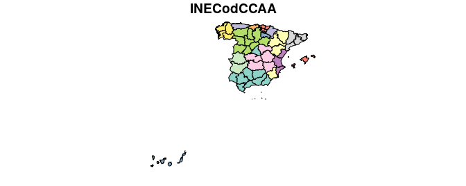

<!-- README.md is generated from README.Rmd. Please edit that file -->

# LAU2boundaries4spain

El objetivo de este repositorio es ofrecer los contornos de los términos
municipales españoles ajustados a los municipios existentes a 1 de enero
de cada año desde 2002, de forma que cuadren exactamente con el Padrón
de dicho año. Los contornos a fecha de 1 de enero de 2002 son
consistentes con los existentes en el censo de 2001, con fecha de
referencia 1 de noviembre de dicho año.

Creemos que dicha base de datos es útil por varias razones. El
[Instituto Geográfico Nacional](http://www.ign.es/web/ign/portal) (IGN)
ofrece, a través del [Centro de
Descargas](http://centrodedescargas.cnig.es/CentroDescargas/index.jsp)
del Centro Nacional de Información Geográfica, los recintos municipales
–también los provinciales y autonómicos– dentro de la Base de Datos de
Líneas de Límite Municipal en la **Información Geográfica de
Referencia**, sin embargo estas bases de datos son de actualización
continua, de forma que lo que se dispone son los municipios “en el
momento actual”, y no existe un histórico que puede ser de utilidad por
muchas razones. Así pues, hasta donde nosotros conocemos, no se dispone,
por ejemplo, de una capa vectorial de los polígonos municipales del año
2006, o de la de los municipios correspondientes al censo de 2001. Esta
información es necesaria si queremos combinar la información geográfica
con la información estadística municipal histórica procedente, por
ejemplo, del [Instituto Nacional de Estadística](http://www.ine.es/)
(INE).

Este repositorio pretende cubrir esa laguna que, de momento, no ha sido
satisfecha por las instituciones oficiales. El repositorio está
disponible como un *package* de *R* alojado en *Github*:
<https://github.com/perezp44/LAU2boundaries4spain>. La información
ofrecida ha ido elaborándose durante bastante tiempo a partir de
diversos trabajos (Goerlich, Mas, Azagra y Chorén 2006, 2007; Goerlich,
Ruiz, Chorén y Albert 2015; Reig, Goerlich y Cantarino 2016).

Información más detallada del proceso seguido para la construcción de
los diferentes ficheros de lindes puede encontrase en una de las
*vignettes* del *package*, concretamente
[aquí](https://htmlpreview.github.io/?https://github.com/perezp44/LAU2boundaries4spain/blob/master/inst/doc/detailed-info-lau2boundaries4spain.html)

## Datos

El paquete proporciona:

  - un fichero con los lindes de las CC.AA (`CCAA`)
  - un fichero con los lindes provinciales (`Provincias`)
  - un fichero con los lindes municipales para cada año del periodo
    2002-2020 (por ejemplo `municipios_2020`)

Los ficheros se ofrecen en formato `spatial-df` del paquete
[`sf`](https://cran.r-project.org/web/packages/sf/index.html)

## Instalación

Para instalar el paquete:

``` r
remotes::install_github("perezp44/LAU2boundaries4spain")
```

## Uso

Para cargar los datos en R:

``` r
library(LAU2boundaries4spain)
CCAA <- CCAA                         #- geometrías de CC.AA
Provincias <- Provincias             #- geometrías provinciales
municipios_2017 <- municipios_2017   #- geometrías municipales año 2017 (años posibles: 2002 - 2020)
```

## Algunos ejemplos de uso

  - Un gráfico simple con el método por defecto del paquete `sf`:

<!-- end list -->

``` r
library(sf)
#> Linking to GEOS 3.6.2, GDAL 2.2.3, PROJ 4.9.3
Provincias <- Provincias
plot(Provincias, max.plot = 1)
```



  - Municipios de Teruel en 2002 y 2020

<!-- end list -->

``` r
library(LAU2boundaries4spain)
library(tidyverse)
#> ── Attaching packages ────────────────────────────────────────────────────────────────────────────────────────────────────────────────── tidyverse 1.3.0 ──
#> ✓ ggplot2 3.2.1     ✓ purrr   0.3.3
#> ✓ tibble  2.1.3     ✓ dplyr   0.8.4
#> ✓ tidyr   1.0.2     ✓ stringr 1.4.0
#> ✓ readr   1.3.1     ✓ forcats 0.4.0
#> ── Conflicts ───────────────────────────────────────────────────────────────────────────────────────────────────────────────────── tidyverse_conflicts() ──
#> x dplyr::filter() masks stats::filter()
#> x dplyr::lag()    masks stats::lag()
library(sf)
library(patchwork)
CCAA_peninsular <- CCAA %>% filter(!NombreCCAA %in% c("Canarias", "Illes Balears", "Ciudades Autónomas de Ceuta y Melilla"))
Prov_aragon <- Provincias %>% filter(NombreCCAA == "Aragón")
muni_teruel_2017 <- municipios_2017 %>% filter(NombreProv == "Teruel")
Pancrudo <- muni_teruel_2017 %>% filter(NombreMuni == "Pancrudo")

p1 <- ggplot(data = CCAA_peninsular) + geom_sf(fill = "antiquewhite") + 
            geom_sf(data = Prov_aragon, color = "red", size = 0.15) +
            geom_sf(data = muni_teruel_2017, color = "blue", size = 0.05) + theme(panel.background = element_rect(fill = "aliceblue"))

p2 <- ggplot(data = Prov_aragon) + geom_sf() + 
      geom_sf(data = muni_teruel_2017, color = "black", size = 0.15, fill = "antiquewhite") + 
      geom_sf(data = Pancrudo, fill = "purple", size = 0.1) + theme_minimal() 
p1 + p2
```


Si queremos situar a Canarias cerca de España:

``` r
library(LAU2boundaries4spain)
library(tidyverse)
library(sf)
library(patchwork)

canarias <- Provincias %>% filter(INECodProv %in% c(35,38))
peninsula <- Provincias %>% filter( !(INECodProv %in% c(35, 38)) )
my_shift <- st_bbox(peninsula)[c(1,2)]- (st_bbox(canarias)[c(1,2)]) + c(-2.4, -1.1)
canarias$geometry <- canarias$geometry + my_shift
st_crs(canarias)  <- st_crs(peninsula)
peninsula_y_canarias <- rbind(peninsula, canarias)

p1 <- ggplot() + geom_sf(data = Provincias)
p2 <- ggplot() + geom_sf(data = peninsula) + geom_sf(data = canarias, fill = "purple") 
p1 + p2 
```


``` r
library(tidyverse)
library(sf)
Provincias <- Provincias
#provincias_df <- Provincias %>% st_set_geometry(NULL) #- le quitas la geometria (se ve mejor)
canarias <- Provincias %>% filter(INECodProv %in% c(35,38))
peninsula <- Provincias %>% filter( !(INECodProv %in% c(35, 38)) )
my_shift <- st_bbox(peninsula)[c(1,2)]- (st_bbox(canarias)[c(1,2)]) + c(9.5,0.5)
canarias$geometry <- canarias$geometry + my_shift
st_crs(canarias)  <- st_crs(peninsula)
provincias_a <- rbind(peninsula, canarias)  
plot(provincias_a, max.plot = 1)
```

Para cargar y dibujar los lindes municipales de 2018:

``` r
library(tidyverse)
library(sf)
library(LAU2boundaries4spain)
municipios_2018 <- municipios_2018
plot(municipios_2018, max.plot = 1)
```

Si queremos generar dibujar los lindes provinciales a partir de las
geometrías municipales de 2016 (más información
[aquí](https://github.com/r-spatial/sf/issues/290)):

``` r
library(tidyverse)
library(sf)
library(LAU2boundaries4spain)
Provincias_2016 <- municipios_2016 %>%  group_by(INECodProv) %>% summarise()
plot(Provincias_2016)
```

Si queremos fusionar los datos de población, o cualquier otra variable
municipal, con el fichero de lindes:

``` r
library(tidyverse)
library(sf)
library(LAU2boundaries4spain)
library(spanishRpoblacion)
pob <- INE_padron_muni_96_17  #- datos de poblacion del Padron 
pob_2016 <- pob %>% filter(anyo == 2016) %>%    # en 2016 habían 8.125 municipios
            select(INECodMuni, Pob_T, Pob_H, Pob_M)  
lindes_2016 <- municipios_2016 #- 8.125 municipios + 84 condominios
fusion_2016 <- full_join(lindes_2016, pob_2016)   
fusion_2016_df <- fusion_2016 %>% st_set_geometry(NULL) #- le quitas la geometria para verlo mejor
```

El sistema de referencia geodésico de las diferentes capas del paquete
es el estándar europeo, ETRS89 en coordenadas geográficas, es decir sin
proyección, y con Canarias en la misma proyección que la Peninsula y
Baleares. Si queremos proyectar la información, por ejemplo a *Lambert
Azimutal Equal Area* (LAEA), hacemos:

``` r
# EPSG Projection 3035 - ETRS89 / ETRS-LAEA 
# Proj4js.defs["EPSG:3035"] = "+proj=laea +lat_0=52 +lon_0=10 +x_0=4321000 +y_0=3210000 +ellps=GRS80 +units=m +no_defs"
library(tidyverse)
library(sf)
library(LAU2boundaries4spain)
Provincias_proj <- st_transform(Provincias, crs = 3035) 
plot(Provincias_proj, max.plot = 1)
```
